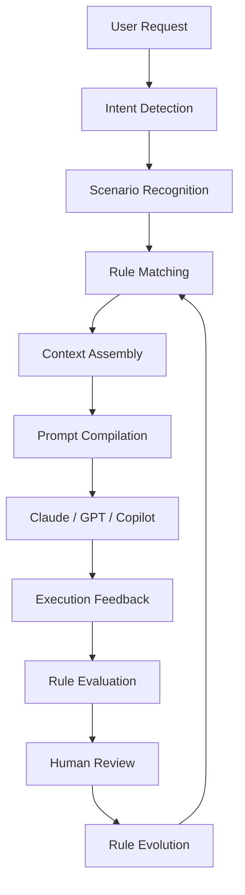
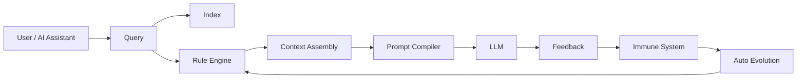

<p align="center">
  <h1 align="center">Rulerything</h1>
  <p align="center">
    <strong>The AI Context Engine for coding assistants.</strong>
  </p>
  <p align="center">
    Automatically discover, compile, and inject the right engineering rules, project standards, and execution context into every AI request.
  </p>
</p>

<p align="center">
  <a href="#quick-start">Quick Start</a> ·
  <a href="#why-rulerything">Why</a> ·
  <a href="#how-it-works">How It Works</a> ·
  <a href="#claude-code-integration">Claude Code</a> ·
  <a href="#architecture">Architecture</a> ·
  <a href="#roadmap">Roadmap</a>
</p>

<p align="center">
  
  
  
  
</p>

---

## What is Rulerything?

Rulerything is a **self-evolving AI Context Engine** designed to give AI coding assistants a deterministic engineering knowledge layer.

Instead of sending vague prompts directly to Claude, GPT, Copilot, or other LLMs, Rulerything first analyzes the request, retrieves the relevant rules, assembles the right context, and then helps the AI execute with clearer boundaries, standards, and project knowledge.

> Stop repeating prompts.  
> Stop losing project context.  
> Let AI follow your engineering standards automatically.

---

## Why Rulerything?

Modern AI coding assistants are powerful, but they share one major weakness:

> They do not automatically know your project rules.

When you ask:

```text
Write a login API.
```

The model may need to guess:

- Which framework should be used?
- Which security rules apply?
- Which database conventions matter?
- Which team coding standards should be followed?
- Which response format is expected?
- Which project-specific constraints must not be violated?

Every missing piece of context increases uncertainty.

Every uncertainty increases hallucination.

Rulerything solves this by turning implicit engineering knowledge into an executable context layer.

---

## The Core Idea

Traditional AI workflow:

```text
User Request
      ↓
LLM guesses missing context
      ↓
Unstable output
```

Rulerything workflow:

```text
User Request
      ↓
Intent Detection
      ↓
Rule Matching
      ↓
Context Assembly
      ↓
Prompt Compilation
      ↓
LLM executes with project-aware context
```

The model no longer receives just a prompt.

It receives a complete execution context.

---

## How It Works



Rulerything acts as the missing execution layer between human intent and LLM output.

---

## What Makes It Different?

Rulerything is not just a prompt library.

It is not just AI memory.

It is not just RAG.

It is a context engine that decides **which rules should be loaded for each request**.

| Approach | Limitation | Rulerything |
|---|---|---|
| Prompt Library | Manual copy and paste | Automatically loads relevant rules |
| Cursor Rules | Mostly static project instructions | Dynamic retrieval and evolution |
| Claude Memory | Broad personal memory | Project-aware engineering context |
| RAG | Retrieves documents | Retrieves executable rules and standards |
| System Prompt | Grows too large and stale | Loads only what is needed |
| Checklist | Human has to remember it | AI receives it before execution |

**Prompt engineering is not enough. Context engineering is the next layer.**

---

## Core Capabilities

### Smart Context Search

Hybrid search across engineering rules using:

- Semantic matching
- Category matching
- Tag matching
- Exact search
- Prefix search
- Smart search contracts

Use it to retrieve the right engineering knowledge before an AI assistant answers.

---

### Self-Evolving Rules

Rules do not have to remain static.

Rulerything can observe usage signals, detect weak rules, identify redundancy, and propose improvements.

The evolution loop is designed around human supervision:

```text
Observe → Measure → Detect → Propose → Review → Promote
```

AI assists.

Humans decide.

---

### Engineering Immune System

Rulerything includes a quality-control layer that helps detect:

- Duplicated rules
- Conflicting rules
- Outdated knowledge
- Low-quality rules
- Redundant instructions
- Unused or stale rules

Each rule can be scored across multiple quality dimensions.

---

### AI Bridge

Optional LLM integration enables:

- Rule proposal
- Knowledge gap detection
- Rule summarization
- Auto-categorization
- Rule optimization
- Rule ingestion from queries

The core search engine works locally without an API key.

Advanced evolution features can use Claude, OpenAI, DeepSeek, or local models.

---

### Self-Adaptive Runtime

Rulerything can monitor and optimize:

- Search latency
- Cache hit rates
- Index performance
- Conflict ratios
- Storage behavior
- Retrieval quality

This allows the system to improve not only its rules, but also its own runtime behavior.

---

## Quick Start

### Install

```bash
pip install .
```

### Start the server

```bash
rulerything-server
```

The server starts at:

```text
http://127.0.0.1:8001
```

### Search the built-in rule base

```bash
rulerything search "SQL injection" --type smart
```

### Other search modes

```bash
rulerything search "Performance Optimization Guidelines" --type exact
rulerything search "Performance" --type prefix
rulerything search "python" --type tag
rulerything search "Python async performance optimization" --type smart
```

### List rules by category

```bash
rulerything list --category security
```

### View rule details

```bash
rulerything get security/001
```

---

## Claude Code Integration

Rulerything is designed to work well with Claude Code.

### One-command setup

```bash
python skill/install.py --project /path/to/your/project --setup-hook
```

### Manual setup

Add this to your project `CLAUDE.md`:

```text
When answering technical questions, query the rule base first:

python /path/to/rulerything/skill/rule_helper.py smart "<your question>"
```

This makes Claude Code consult your engineering rule base before answering.

---

## Example

### Without Rulerything

```text
User:
Write a REST login API.

LLM has to guess:
- Framework
- Security model
- Naming conventions
- Error format
- Logging standard
- Validation rules

Result:
Inconsistent output.
```

### With Rulerything

```text
User:
Write a REST login API.

Rulerything:
- Detects API development intent
- Loads REST rules
- Loads authentication rules
- Loads project conventions
- Loads security constraints
- Assembles execution context

LLM:
Produces output aligned with the rule base.
```

---

## Built-in Knowledge

Rulerything includes:

- **994 built-in engineering rules**
- **34 technology categories**

Categories include:

```text
ai api cpp css database devops docker dotnet git go java javascript lua
mobile nodejs pattern performance philosophy php process python react ruby
rust security shell test typescript vue zig
```

---

## Architecture

```text
main.py                → Side-effect-free FastAPI application factory
├── core/repository.py → Single writable repository boundary
├── index.py           → exact / prefix / tag / smart search contracts
├── storage_v2.py      → SQLite runtime store
├── entropy_engine.py  → Performance monitoring and tuning
├── immune_system.py   → Quality scoring and conflict detection
├── adaptive_system.py → Self-adaptive orchestration
├── ai_bridge.py       → LLM-powered proposal and gap detection
├── auto_evolver.py    → Automated rule evolution with validation
├── auto_ingest.py     → Automated rule ingestion from queries
├── gap_detector.py    → Knowledge gap identification
├── cli.py             → Command-line interface
└── semantic_plugin/   → Optional semantic search plugin
```

High-level runtime:



---

## Core Modules

| Module | Description |
|---|---|
| `repository` | Selects exactly one writable backend; JSONL only seeds an empty SQLite database |
| `storage_v2` | SQLite runtime storage with transactions, snapshots, and hot/cold tiering |
| `index` | Search contracts for exact, prefix, tag, and smart retrieval |
| `entropy_engine` | Monitors cache hit rates, latency, and conflict ratios; triggers auto-tuning |
| `immune_system` | Scores rule quality and scans conflicts, staleness, and redundancy |
| `adaptive_system` | Coordinates subsystems with circuit-breaker isolation |
| `ai_bridge` | Optional LLM integration for rule proposal, ingestion, and gap analysis |
| `auto_evolver` | Validates and applies rule improvements under configured thresholds |

---

## Configuration

Edit `config.yaml` to control runtime behavior.

Common configuration areas:

| Config | Purpose |
|---|---|
| `server.host` / `server.port` | HTTP server binding |
| `storage.backend` | Single writable backend: `sqlite` or `jsonl` |
| `index.*` | Cache thresholds and rebuild schedule |
| `evolution.*` | Auto-apply behavior and confidence thresholds |
| `immune.*` | Quality scoring weights |
| `ai_bridge.*` | Provider, model, and API key environment variable |

Environment overrides:

```bash
export RULERYTHING_CONFIG=/path/to/config.yaml
export RULERYTHING_DATA_DIR=/path/to/data
export RULERYTHING_LOG_DIR=/path/to/logs
```

---

## API Keys

Basic search requires **no API key**.

The core retrieval engine uses local search.

Advanced AI features require an LLM provider key.

| Feature | API Key Required | Notes |
|---|---:|---|
| Smart search | No | Local retrieval |
| Rule auto-extraction | Yes | Generate candidate rules from queries |
| Knowledge gap detection | Yes | Detect missing knowledge areas |
| Rule auto-evolution | Yes | AI-assisted scoring and optimization |

Supported providers:

```bash
export DEEPSEEK_API_KEY="sk-xxxx"
export ANTHROPIC_API_KEY="sk-xxxx"
export OPENAI_API_KEY="sk-xxxx"
```

Example `config.yaml`:

```yaml
ai_bridge:
  provider: deepseek
  api_key_env: "DEEPSEEK_API_KEY"
```

`.env` is ignored by Git and should not be committed.

---

## Use Cases

### AI Coding Assistant Knowledge Layer

Give Claude Code, Copilot, GPT, and other assistants a deterministic rule layer before they answer.

### Team Coding Standards

Maintain a shared, searchable, evolving rule base for your engineering team.

### Code Review Checklist

Use rules as searchable review criteria for pull requests.

### Onboarding

Help new developers quickly understand project conventions and technology-specific best practices.

### Enterprise Knowledge Management

Deploy a private engineering rule base with custom standards, architecture rules, security policies, and compliance constraints.

---

## Roadmap

- [ ] Multi-project context profiles
- [ ] Rule package system
- [ ] Organization-level governance
- [ ] MCP integration
- [ ] IDE plugins
- [ ] Context marketplace
- [ ] Rule evaluation benchmark
- [ ] Team approval workflow
- [ ] Multi-agent collaboration
- [ ] Cloud and self-hosted deployment templates

---

## Project Philosophy

Rules are evolving.

Traditional rules are static.

They are written once, forgotten, and eventually become obsolete.

Rulerything is different.

Rules can learn.

They observe every execution, detect conflicts, identify redundancy, and improve under human supervision.

The goal is not to eliminate complexity.

The goal is to make complexity ordered, transparent, and alive.

From software engineering to law, from algorithms to governance, from business workflows to AI systems, Rulerything aims to build a world where everything can be expressed, managed, and evolved as executable rules.

> The nature of the world has always been rules.  
> Only now do we finally have a way to orchestrate them.

---

## Contributing

Contributions are welcome.

You can help by:

- Adding new engineering rules
- Improving rule categories
- Testing integrations
- Reporting conflicts or stale rules
- Improving documentation
- Building plugins

Before contributing, please make sure new rules are:

- Clear
- Actionable
- Non-duplicated
- Properly categorized
- Useful for AI-assisted engineering workflows

---

## License

Apache 2.0. See [LICENSE](LICENSE).
