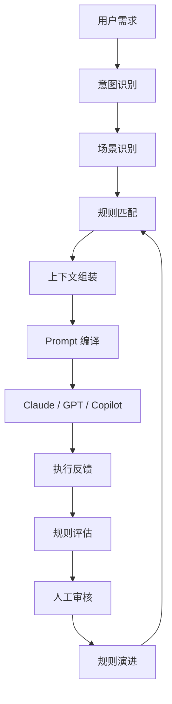
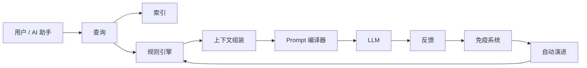

# Rulerything

> **面向 AI 编程助手的 AI 上下文引擎。**
>
> 自动识别、编译并注入正确的工程规则、项目规范和执行上下文，让 AI 在回答之前先知道边界、标准和项目背景。

Rulerything 是一个**自演进 AI Context Engine**，用于为 Claude Code、Copilot、GPT 等 AI 编程助手提供确定性的工程知识层。

它不是让开发者一遍遍写更复杂的 Prompt，而是在请求进入模型之前，自动加载相关的工程规则、编码规范、项目约定和领域知识。

> 不再重复写 Prompt。  
> 不再丢失项目上下文。  
> 让 AI 自动遵守你的工程标准。

---

## Rulerything 是什么？

现代 AI 编程助手很强，但有一个核心问题：

> 它们不会自动知道你的项目规则。

当你说：

```text
写一个登录 API。
```

AI 需要猜：

- 用什么框架？
- 遵守什么安全规则？
- 数据库规范是什么？
- 团队代码风格是什么？
- 错误返回格式是什么？
- 哪些项目约束不能违反？

每一个缺失的上下文，都会增加不确定性。

每一个不确定性，都会增加幻觉。

Rulerything 要解决的就是：

> 把隐性的工程经验显性化，把项目规范结构化，把模糊需求标准化。

---

## 核心逻辑

传统 AI 工作流：

```text
用户需求
      ↓
AI 猜测缺失上下文
      ↓
输出不稳定
```

Rulerything 工作流：

```text
用户需求
      ↓
意图识别
      ↓
规则匹配
      ↓
上下文组装
      ↓
Prompt 编译
      ↓
AI 基于项目上下文执行
```

AI 拿到的不再是一句模糊指令。

而是一份完整的执行上下文。

---

## 工作流程



Rulerything 是人类需求与 LLM 输出之间缺失的执行层。

---

## 它和普通 Prompt 工具有何不同？

Rulerything 不是 Prompt 收藏夹。

不是普通 AI Memory。

也不是单纯 RAG。

它的核心能力是：

> 自动判断每个 AI 请求应该加载哪些规则。

| 方案 | 局限 | Rulerything |
|---|---|---|
| Prompt Library | 需要手动复制粘贴 | 自动加载相关规则 |
| Cursor Rules | 偏静态项目说明 | 动态检索和持续演进 |
| Claude Memory | 偏通用个人记忆 | 面向项目的工程上下文 |
| RAG | 检索文档 | 检索可执行规则和标准 |
| System Prompt | 越写越大、容易过时 | 只加载当前任务需要的上下文 |
| Checklist | 依赖人记住 | AI 执行前自动注入 |

**Prompt Engineering 不是终点。Context Engineering 才是下一层。**

---

## 核心能力

### Smart Context Search

支持混合检索：

- 语义搜索
- 分类搜索
- 标签搜索
- 精确搜索
- 前缀搜索
- Smart Search

用于在 AI 回答之前，检索最相关的工程知识。

---

### Self-Evolving Rules

规则不必永远静态。

Rulerything 可以观察使用数据、发现弱规则、识别冗余和冲突，并提出优化建议。

规则演进流程：

```text
观察 → 度量 → 检测 → 提案 → 审核 → 发布
```

AI 辅助。

人类决定。

---

### Engineering Immune System

内置工程规则免疫系统，可检测：

- 重复规则
- 冲突规则
- 过时知识
- 低质量规则
- 冗余指令
- 长期未使用规则

每条规则都可以进行多维质量评分。

---

### AI Bridge

可选 LLM 集成能力包括：

- 规则提案
- 知识缺口检测
- 规则总结
- 自动分类
- 规则优化
- 从查询中提炼新规则

基础搜索无需 API Key。

高级演进能力可接入 Claude、OpenAI、DeepSeek 或本地模型。

---

### Self-Adaptive Runtime

系统可持续监控并优化：

- 搜索延迟
- 缓存命中率
- 索引性能
- 冲突比例
- 存储行为
- 检索质量

让规则库和运行系统一起进化。

---

## 快速开始

### 安装

```bash
pip install .
```

### 启动服务

```bash
rulerything-server
```

服务地址：

```text
http://127.0.0.1:8001
```

### 搜索内置规则库

```bash
rulerything search "SQL injection" --type smart
```

### 其他搜索方式

```bash
rulerything search "Performance Optimization Guidelines" --type exact
rulerything search "Performance" --type prefix
rulerything search "python" --type tag
rulerything search "Python async performance optimization" --type smart
```

### 按分类列出规则

```bash
rulerything list --category security
```

### 查看规则详情

```bash
rulerything get security/001
```

---

## Claude Code 集成

Rulerything 天然适合 Claude Code。

### 一键安装

```bash
python skill/install.py --project /path/to/your/project --setup-hook
```

### 手动集成

在项目 `CLAUDE.md` 中加入：

```text
When answering technical questions, query the rule base first:

python /path/to/rulerything/skill/rule_helper.py smart "<your question>"
```

这样 Claude Code 在回答技术问题前，会先查询规则库。

---

## 示例

### 没有 Rulerything

```text
用户：
写一个 REST 登录 API。

AI 需要猜：
- 框架
- 安全模型
- 命名规范
- 错误格式
- 日志标准
- 参数校验规则

结果：
输出不稳定。
```

### 使用 Rulerything

```text
用户：
写一个 REST 登录 API。

Rulerything：
- 识别 API 开发意图
- 加载 REST 规则
- 加载认证规则
- 加载项目约定
- 加载安全约束
- 组装执行上下文

AI：
输出符合规则库标准的结果。
```

---

## 内置知识

Rulerything 内置：

- **994 条工程规则**
- **34 个技术分类**

分类包括：

```text
ai api cpp css database devops docker dotnet git go java javascript lua
mobile nodejs pattern performance philosophy php process python react ruby
rust security shell test typescript vue zig
```

---

## 架构

```text
main.py                → 无副作用 FastAPI 应用工厂
├── core/repository.py → 单一可写仓储边界
├── index.py           → exact / prefix / tag / smart 搜索契约
├── storage_v2.py      → SQLite 运行时存储
├── entropy_engine.py  → 性能监控与调优
├── immune_system.py   → 质量评分与冲突检测
├── adaptive_system.py → 自适应系统编排
├── ai_bridge.py       → LLM 驱动的规则提案与缺口检测
├── auto_evolver.py    → 带验证的自动规则演进
├── auto_ingest.py     → 从查询中自动提炼规则
├── gap_detector.py    → 知识缺口识别
├── cli.py             → 命令行接口
└── semantic_plugin/   → 可选语义搜索插件
```

高层运行结构：



---

## 核心模块

| 模块 | 说明 |
|---|---|
| `repository` | 选择唯一可写后端；JSONL 仅用于初始化空 SQLite 数据库 |
| `storage_v2` | SQLite 运行时存储，支持事务、快照和冷热分层 |
| `index` | exact、prefix、tag、smart 检索契约 |
| `entropy_engine` | 监控缓存命中率、延迟、冲突比例，并触发自动调优 |
| `immune_system` | 规则质量评分，扫描冲突、过时和冗余 |
| `adaptive_system` | 通过熔断机制协调各子系统 |
| `ai_bridge` | 可选 LLM 集成，用于规则提案、摄取和缺口分析 |
| `auto_evolver` | 在配置阈值下验证并应用规则改进 |

---

## 配置

编辑 `config.yaml` 控制运行行为。

常见配置：

| 配置 | 作用 |
|---|---|
| `server.host` / `server.port` | HTTP 服务绑定 |
| `storage.backend` | 单一可写后端：`sqlite` 或 `jsonl` |
| `index.*` | 缓存阈值和重建计划 |
| `evolution.*` | 自动应用策略和置信度阈值 |
| `immune.*` | 质量评分权重 |
| `ai_bridge.*` | Provider、模型和 API Key 环境变量 |

环境变量覆盖：

```bash
export RULERYTHING_CONFIG=/path/to/config.yaml
export RULERYTHING_DATA_DIR=/path/to/data
export RULERYTHING_LOG_DIR=/path/to/logs
```

---

## API Key

基础搜索无需 API Key。

核心检索使用本地搜索。

高级 AI 功能需要 LLM Provider Key。

| 功能 | 是否需要 API Key | 说明 |
|---|---:|---|
| Smart Search | 否 | 本地检索 |
| 规则自动提炼 | 是 | 从查询中生成候选规则 |
| 知识缺口检测 | 是 | 发现缺失的知识领域 |
| 规则自动演进 | 是 | AI 辅助评分和优化 |

支持的 Provider：

```bash
export DEEPSEEK_API_KEY="sk-xxxx"
export ANTHROPIC_API_KEY="sk-xxxx"
export OPENAI_API_KEY="sk-xxxx"
```

示例 `config.yaml`：

```yaml
ai_bridge:
  provider: deepseek
  api_key_env: "DEEPSEEK_API_KEY"
```

`.env` 已被 Git 忽略，不应提交。

---

## 使用场景

### AI 编程助手知识层

让 Claude Code、Copilot、GPT 等 AI 助手在回答前先加载确定性的规则层。

### 团队编码规范

维护一套共享、可搜索、持续演进的工程规则库。

### Code Review 检查清单

将规则作为 Pull Request 审查时可检索的检查标准。

### 新成员 Onboarding

帮助新开发者快速理解项目约定和特定技术栈最佳实践。

### 企业知识管理

私有部署企业工程规则库，管理架构规范、安全策略、合规要求和项目标准。

---

## Roadmap

- [ ] 多项目上下文 Profile
- [ ] 规则包系统
- [ ] 组织级治理
- [ ] MCP 集成
- [ ] IDE 插件
- [ ] Context Marketplace
- [ ] 规则评测基准
- [ ] 团队审批流程
- [ ] 多智能体协作
- [ ] 云端与私有化部署模板

---

## 项目哲学

规则在进化。

传统的规则是静态的。

写下来，落灰，过时，被遗忘。

Rulerything 不同。

规则可以学习。

它们观察每一次执行，发现冲突，识别冗余，并在人类监督下持续优化。

目标不是消灭复杂性。

而是让复杂性变得有序、透明、有生命。

从软件工程到法律，从算法到治理，从业务流程到 AI 系统，Rulerything 正在构建一个万物皆可规则化、管理化、演进化的世界。

> 世界的本质，从来都是规则。  
> 只是现在，我们终于有了驾驭它们的方式。

---

## 贡献

欢迎贡献。

你可以帮助：

- 添加新的工程规则
- 改进规则分类
- 测试集成能力
- 报告冲突或过时规则
- 改进文档
- 构建插件

新增规则应尽量满足：

- 清晰
- 可执行
- 不重复
- 分类准确
- 对 AI 辅助工程工作流有帮助

---

## License

Apache 2.0. See [LICENSE](LICENSE).
